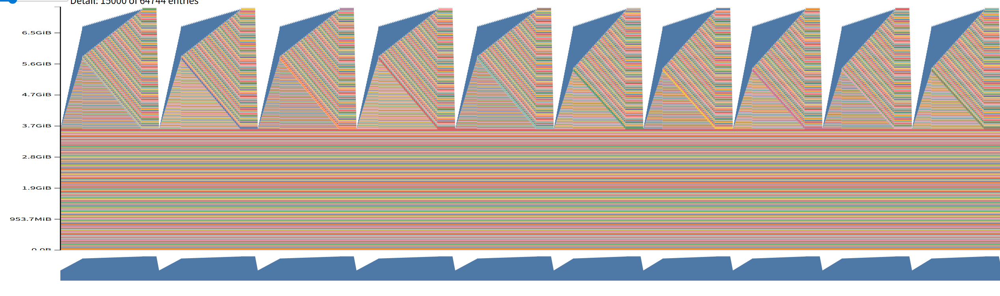
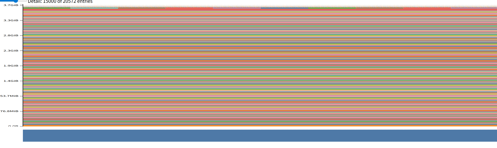

# Profilling and Benchmarking
- 测试的 GPU 为 4060 LAPTOP

## End-to-End Benchmarking
- 因为显存不够，所以仅对 small, medium, large 的模型做了测试，仅对 small, medium的模型做了 forward+backward 测试

- (b)：经过 5 次预热后，标准差极小，例如 Small 模型的前向传播耗时为 27.84 ± 0.37 ms，完整步骤（前向+反向）耗时为 95.50 ± 1.83 ms。
- (c)：无预热时，由于首次运行的冷启动开销（如 CUDA 内核即时编译和内存分配），数据波动极大；进行 1-2 次预热时，初始化可能尚未完全完成，标准差小很多，但是与预热五次的还有一点差距。

- warmup=5, steps=10:

| Model Size   |   Context Length | Mode         | Time (ms)       |
|:-------------|-----------------:|:-------------|:----------------|
| small        |              128 | Forward Only | 27.84 ± 0.37     |
| small        |              256 | Forward Only | 63.47 ± 1.95     |
| medium       |              128 | Forward Only | 92.29 ± 3.95     |
| medium       |              256 | Forward Only | 171.68 ± 6.60    |
| large        |              128 | Forward Only | 179.11 ± 1.37     |
| large        |              256 | Forward Only | 8542.52 ± 1139.16(OOM) |

| Model Size   |   Context Length | Mode      | Time (ms)      |
|:-------------|-----------------:|:----------|:---------------|
| small        |              128 | Full Step | 95.50 ± 1.83   |
| small        |              256 | Full Step | 175.00 ± 5.07  |
| medium       |              128 | Full Step | 300.17 ± 9.70  |
| medium       |              256 | Full Step | 553.07 ± 14.19 |
| large        |              128 | Full Step | 1462.43 ± 41.08(OOM) |

- warmup=0, steps=10

| Model Size   |   Context Length | Mode         | Time (ms)      |
|:-------------|-----------------:|:-------------|:---------------|
| small        |              128 | Forward Only | 62.93 ± 101.51 |
| small        |              256 | Forward Only | 70.64 ± 13.82  |
| medium       |              128 | Forward Only | 100.19 ± 4.06  |
| medium       |              256 | Forward Only | 184.73 ± 12.47 |
| large        |              128 | Forward Only | 241.77 ± 100.90   |
| large        |              256 | Forward Only | 10662.79 ± 628.70(OOM) |

| Model Size   |   Context Length | Mode      | Time (ms)       |
|:-------------|-----------------:|:----------|:----------------|
| small        |              128 | Full Step | 134.06 ± 123.51 |
| small        |              256 | Full Step | 194.87 ± 22.13  |
| medium       |              128 | Full Step | 319.49 ± 20.86  |
| medium       |              256 | Full Step | 572.62 ± 38.22  |
| large        |              128 | Full Step | 1546.02 ± 146.03(OOM) |

- warmup=1, steps=10 (仅进行部分测试)

| Model Size   |   Context Length | Mode      | Time (ms)      |
|:-------------|-----------------:|:----------|:---------------|
| small        |              128 | Full Step | 96.92 ± 2.85   |
| small        |              256 | Full Step | 185.39 ± 9.61  |
| medium       |              128 | Full Step | 304.94 ± 10.20 |
| medium       |              256 | Full Step | 566.98 ± 26.15 |

## Nsight Systems Profiler
- 测试时，small: context-length=1024时OOM；medium: context-length=512时OOM；large: context-length=128时OOM

- (a) 总体而言，模型越大，python代码相比 nvtx 的差距越大，即越慢
- (b) 该题使用 medium, context-length=256时的数据
    - forward pass，耗时最长的 kernel为：ampere_sgemm_128x64_tn 以及 ampere_sgemm_64x64_tn，各花费约 21.142ms(18次), 21.051ms(44次)
    - forward + backward：有四个 kernel 耗时相近，如下表

|Time	|Total| Time|	Instances|	
|:-----|------|----:|:-----------|
|16.4%	|93.842 ms|	143|	ampere_sgemm_128x64_nn|
|16.3%	|93.573 ms|	73|	ampere_sgemm_64x64_nt|
|11.9%	|68.230 ms|	49|	ampere_sgemm_64x64_tn|
|11.4%|	65.531 ms|	120|	ampere_sgemm_128x64_tn|
    
- (c) 除矩阵乘法外，各种逐元素操作（Element-wise）的 Kernel 也占据了一定运行时间。包括：
    - `void at::native::vectorized_elementwise_kernel<(int)4, at::native::BinaryFunctor<float, float, float, at::native::binary_internal::MulFunctor<float>>, std::array<char *, (unsigned long)3>>(int, T2, T3)`: 占据 6.0%
    - `void at::native::elementwise_kernel<(int)128, (int)2, void at::native::gpu_kernel_impl_nocast<at::native::BinaryFunctor<float, float, float, at::native::binary_internal::MulFunctor<float>>>(at::TensorIteratorBase &, const T1 &)::[lambda(int) (instance 1)]>(int, T3)`: 占据 3.9%

- (d) 矩阵乘法部分，和 (b) 一致，非矩阵乘法部分前几个如下
    - `void at::native::vectorized_elementwise_kernel<(int)4, at::native::BinaryFunctor<float, float, float, at::native::binary_internal::MulFunctor<float>>, std::array<char *, (unsigned long)3>>(int, T2, T3)`: 7.6%
    - `void at::native::elementwise_kernel<(int)128, (int)2, void at::native::gpu_kernel_impl_nocast<at::native::BinaryFunctor<float, float, float, at::native::binary_internal::MulFunctor<float>>>(at::TensorIteratorBase &, const T1 &)::[lambda(int) (instance 1)]>(int, T3)`: 5.2%
    - `void at::native::elementwise_kernel<(int)128, (int)2, void at::native::gpu_kernel_impl_nocast<at::native::direct_copy_kernel_cuda(at::TensorIteratorBase &)::[lambda() (instance 3)]::operator ()() const::[lambda() (instance 7)]::operator ()() const::[lambda(float) (instance 1)]>(at::TensorIteratorBase &, const T1 &)::[lambda(int) (instance 1)]>(int, T3)`: 4.3%
    - `void at::native::vectorized_elementwise_kernel<(int)4, at::native::CUDAFunctor_add<float>, std::array<char *, (unsigned long)3>>(int, T2, T3)`: 2.4%
    - `void at::native::vectorized_elementwise_kernel<(int)4, void at::native::<unnamed>::pow_tensor_scalar_kernel_impl<float, float>(at::TensorIteratorBase &, T2)::[lambda(float) (instance 1)], std::array<char *, (unsigned long)2>>(int, T2, T3)`: 2.2%
    - `void at::native::elementwise_kernel<(int)128, (int)2, void at::native::gpu_kernel_impl_nocast<at::native::BinaryFunctor<float, float, float, at::native::binary_internal::DivFunctor<float>>>(at::TensorIteratorBase &, const T1 &)::[lambda(int) (instance 1)]>(int, T3)`: 2.0%

- (e) 基于medium, ctx=256的数据，对比如下表：
    - 明显发现 softmax的 FLOPs 比 matmul 小很多，但是runtimes却没有明显差距
    - matmul：$4·b·n^2·d$；softmax: $3⋅b⋅h⋅n^2$
    - b: batch, n:seq_len, d: d_model, h: num_heads

|     | softmax | matmul |
|-----|---------|--------|
|FLOPs/layer|  0.01GFLOPs   |  1.07GFLOPs   |
|runtimes|70.34 ms | 88.08 ms |

- forward pass:

| Model Size   |   Context Length | Time (ms)      |
|:-------------|-----------------:|:---------------|
| small        |              128 | 30.40 ± 5.95   |
| small        |              256 | 57.60 ± 104.59 |
| small        |              512 | 61.04 ± 121.55 |
| medium       |              128 | 85.39 ± 120.07 |
| medium       |              256 | 89.74 ± 138.14 |

- backward pass:

| Model Size   |   Context Length | Time (ms)      |
|:-------------|-----------------:|:---------------|
| small        |              128 | 66.12 ± 2.21   |
| small        |              256 | 153.01 ± 21.13 |
| small        |              512 | 385.47 ± 2.81  |
| medium       |              128 | 240.99 ± 16.38 |
| medium       |              256 | 500.86 ± 14.60 |

- optimizer step:

| Model Size   |   Context Length | Time (ms)   |
|:-------------|-----------------:|:------------|
| small        |              128 | 0.36 ± 0.11 |
| small        |              256 | 0.38 ± 0.12 |
| small        |              512 | 0.44 ± 0.15 |
| medium       |              128 | 0.50 ± 0.12 |
| medium       |              256 | 0.51 ± 0.09 |

total:

| Model Size   |   Context Length | Time (ms)       |
|:-------------|-----------------:|:----------------|
| small        |              128 | 96.89 ± 6.35    |
| small        |              256 | 210.99 ± 106.70 |
| small        |              512 | 446.95 ± 121.58 |
| medium       |              128 | 326.87 ± 121.18 |
| medium       |              256 | 591.11 ± 138.91 |

## Mixed Precesion

- (a) ToyModel
    - parameters：保持FP32
    - Output of FFN: FP16
    - Output of layer norm：FP32
    - logits：FP16
    - Loss：FP32
    - Gradients：FP32

- (b) LayerNorm 中对数值精度最敏感的部分是 均值（mean）和方差（variance）的计算以及归一化（除以标准差）; BF16 具有与 FP32 相同的指数范围，相对FP16 不易发生下溢/溢出

- (c) 混合精度下测试结果如下，warmup=5, steps=10，相比FP32，可见速度快了许多

| Model Size   |   Context Length | Mode         | Time (ms)    |
|:-------------|-----------------:|:-------------|:-------------|
| small        |              128 | Forward Only | 23.18 ± 6.02 |
| small        |              256 | Forward Only | 26.56 ± 0.45 |
| medium       |              128 | Forward Only | 45.29 ± 2.54 |
| medium       |              256 | Forward Only | 80.87 ± 0.92 |
| large        |              128 | Forward Only | 92.46 ± 1.37  |
| large        |              256 | Forward Only | 233.93 ± 4.54 |

| Model Size   |   Context Length | Mode      | Time (ms)     |
|:-------------|-----------------:|:----------|:--------------|
| small        |              128 | Full Step | 61.95 ± 1.27  |
| small        |              256 | Full Step | 94.02 ± 2.03  |
| medium       |              128 | Full Step | 172.92 ± 3.40 |
| medium       |              256 | Full Step | 271.71 ± 6.26 |
| large        |              128 | Full Step | 12234.11 ± 286.27(OOM) |

## Profiling Memory
- 因为显存问题，使用 large 模型
- bf16 与 fp32下 training loop 的 context_length 为 128 时均出现OOM
- 以下为不同条件下的 peak memory

|precision/| 128(infer) | 256(infer) | 512(infer) | 128(train) |
|---------|-------------|------------|------------|------------|
|bf16     |5.53GB       |5.56GB      |5.77GB      |7.56GB      |
|fp32     |3.78GB       |3.87GB      |4.16GB      |7.52GB      |

- (a) 以下分别是 fp32 时的 memory timeline, 分别为 context128-train, context256-forward；可见 forward 的内存占用比较平滑，而 train 的内存占用会有起伏

- (b) 见上表

- (c) 见上表，相同条件下，mixed precision 确实占用了更多的内存

- (d) 对于 2.7B 模型来说，当 context_length 为 1024 时，activations 的 size 为 10MB
    - $1024 \times 2056 \times 4 / 1024^2$
    - 对于 large 模型，其占用为 5 MB (context_length为128时约为 0.8MB，考虑batch以及layer后为 90MB)

# Optimizing Attention

## benchmark attention:

- seq_len=8196 时即 OOM，表中的 Memory 统计的是反向传播开始前的内存占用

|   d_model |   seq_len | Forward (ms)   | Backward (ms)   | Memory (GB)     |
|----------:|----------:|:---------------|:----------------|:----------------|
|        16 |       256 | 0.28 ± 0.04    | 0.48 ± 0.08     | 0.0203 ± 0.0000 |
|        16 |      1024 | 2.04 ± 0.09    | 5.10 ± 0.23     | 0.0814 ± 0.0000 |
|        16 |      4096 | 34.05 ± 0.73   | 79.71 ± 1.52    | 1.0397 ± 0.0000 |
|        32 |       256 | 0.27 ± 0.02    | 0.48 ± 0.08     | 0.0208 ± 0.0000 |
|        32 |      1024 | 2.06 ± 0.09    | 5.06 ± 0.13     | 0.0833 ± 0.0000 |
|        32 |      4096 | 34.66 ± 0.89   | 80.89 ± 1.74    | 1.0475 ± 0.0000 |
|        64 |       256 | 0.38 ± 0.09    | 0.65 ± 0.18     | 0.0218 ± 0.0000 |
|        64 |      1024 | 2.12 ± 0.12    | 5.40 ± 0.38     | 0.0873 ± 0.0000 |
|        64 |      4096 | 35.51 ± 1.13   | 82.92 ± 2.66    | 1.0631 ± 0.0000 |
|       128 |       256 | 0.32 ± 0.09    | 0.63 ± 0.19     | 0.0238 ± 0.0000 |
|       128 |      1024 | 2.31 ± 0.32    | 5.49 ± 0.39     | 0.0951 ± 0.0000 |
|       128 |      4096 | 37.38 ± 1.25   | 85.13 ± 2.36    | 1.0944 ± 0.0000 |

## benchmark JIT-compiled Attention

### torch compile

- compile 之后的 attention 测试结果如下

|   d_model |   seq_len | Forward (ms)   | Backward (ms)   | Memory (GB)     |
|----------:|----------:|:---------------|:----------------|:----------------|
|        16 |       256 | 0.18 ± 0.02    | 0.33 ± 0.04     | 0.0203 ± 0.0000 |
|        16 |      1024 | 0.73 ± 0.09    | 1.95 ± 0.18     | 0.0804 ± 0.0000 |
|        16 |      4096 | 9.70 ± 0.18    | 28.10 ± 0.18    | 1.0242 ± 0.0000 |
|        32 |       256 | 0.22 ± 0.02    | 0.33 ± 0.03     | 0.0208 ± 0.0000 |
|        32 |      1024 | 0.73 ± 0.07    | 1.88 ± 0.13     | 0.0824 ± 0.0000 |
|        32 |      4096 | 9.77 ± 0.17    | 27.87 ± 0.20    | 1.0320 ± 0.0000 |
|        64 |       256 | 0.26 ± 0.05    | 0.47 ± 0.11     | 0.0218 ± 0.0000 |
|        64 |      1024 | 0.75 ± 0.05    | 2.01 ± 0.11     | 0.0863 ± 0.0000 |
|        64 |      4096 | 9.95 ± 0.31    | 28.38 ± 0.62    | 1.0476 ± 0.0000 |
|       128 |       256 | 0.24 ± 0.04    | 0.52 ± 0.10     | 0.0237 ± 0.0000 |
|       128 |      1024 | 0.90 ± 0.07    | 2.38 ± 0.15     | 0.0941 ± 0.0000 |
|       128 |      4096 | 11.10 ± 0.31   | 30.82 ± 0.57    | 1.0789 ± 0.0000 |

- compile 之后的 model 测试结果如下，相比 end-to-end benchmark的结果快了许多：

| Model Size   |   Context Length | Mode      | Time (ms)     |
|:-------------|-----------------:|:----------|:--------------|
| small        |              128 | Full Step | 40.50 ± 0.67  |
| small        |              256 | Full Step | 62.51 ± 0.80  |
| medium       |              128 | Full Step | 128.03 ± 1.97 |
| medium       |              256 | Full Step | 191.48 ± 4.55 |

| Model Size   |   Context Length | Mode         | Time (ms)     |
|:-------------|-----------------:|:-------------|:--------------|
| small        |              128 | Forward Only | 22.64 ± 10.66 |
| small        |              256 | Forward Only | 14.15 ± 0.37  |
| medium       |              128 | Forward Only | 28.12 ± 0.53  |
| medium       |              256 | Forward Only | 49.09 ± 1.36  |